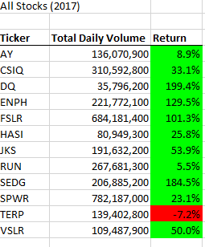
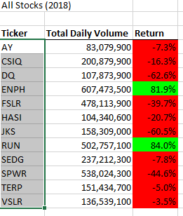
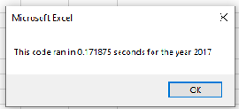
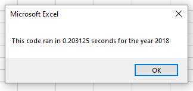
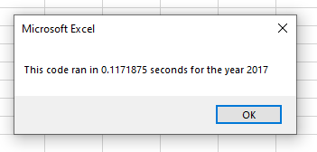
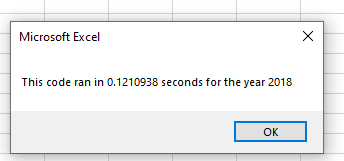

# Stock-Analysis

## Overview of Project

### Purpose
The purpose of this project is to refactor the solution code effectively to make the VBA script run quicker.
This analysis looks at the total daily volume and returns relying upon the year of stocks in the data set.

## Results
The stock performance in 2017 gave more positive returns in 2018.  

## Summary
Likely benefits of refractoring may incorporate further develop code comprehensibility and diminished complexity.
The disadvantages of refractoring code is that its time consuming.

